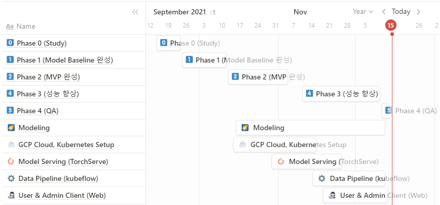
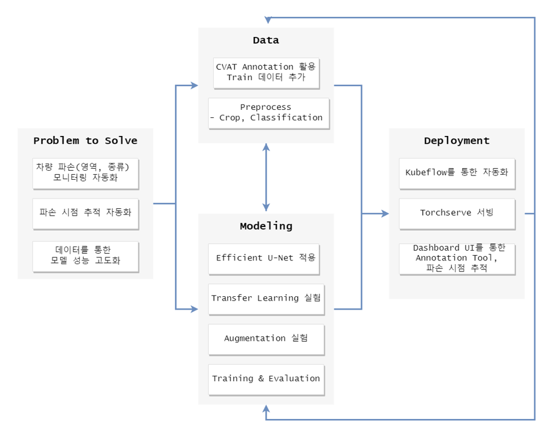
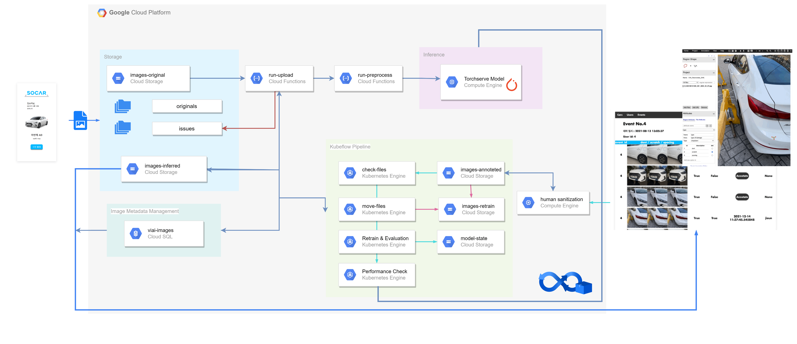
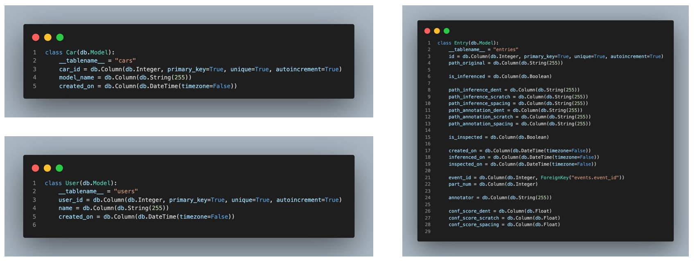
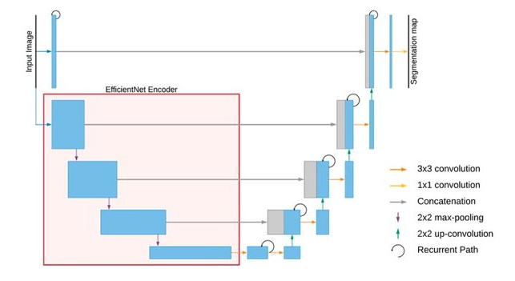
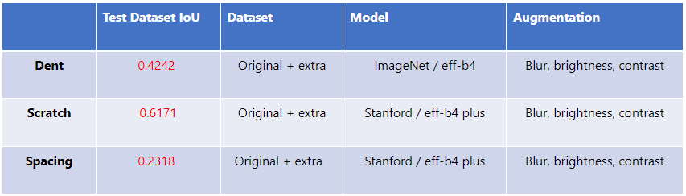
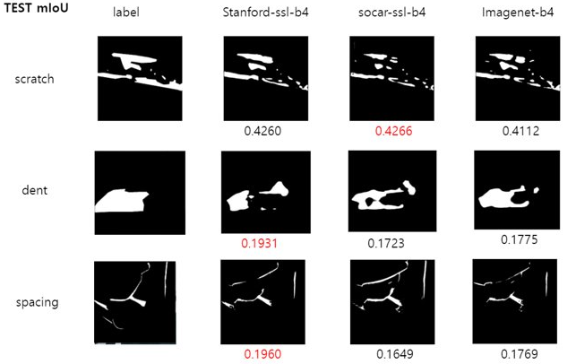
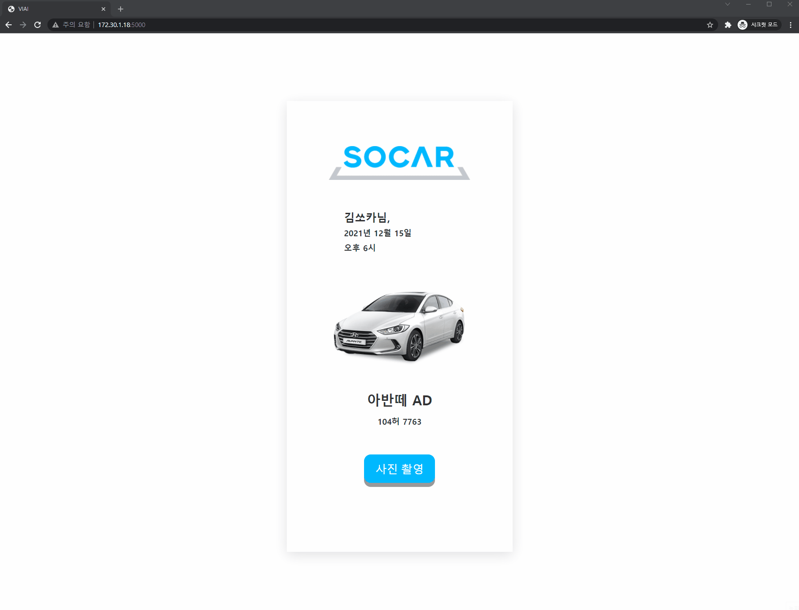

# VIAI (Vehicle Inspection AI) Project Overview

Table of Contents
=================

  * [Overview](#Overview)
    * [Team Introduction](#팀소개)
    * [Problem Definition](#문제정의)
    * [Goal](#프로젝트목표)
    * [Project-Milestone](#Project-Milestone)
  * [Workflow](#Workflow)
    * [Model Workflow for Data-Centered AI](#Model-Workflow)
    * [Architecture](#Architecture)
    * [DB Architecture](#DB-Architecture)
    * [Model](#Model) 
    * [Mask Image Example](#Mask-Image-Example)
  * [Tech Stack](#Tech-Stack)
  * [Repositories](#Repositories)
  * [DEMO](#DEMO)

## Overview

2021.11.10 ~2021.12.15 약 한달간 진행된 VIAI (Vehicle Inspection AI) 프로젝트의 Overview와 각 리포지토리 설명, 노션의 다큐멘테이션을 정리해보았습니다.

**모두의연구소 AIFFEL** 과 **SOCAR**의 기업 협력 과제인 ***차량 파손 탐지***를 주제로 프로젝트를 진행하였습니다. 

## 팀 소개

|  Name | Role | Email | Focus |
| --- | ---- | --- | --- |
| [전지은 (Jieun Jeon](https://github.com/jieunjeon) | 팀장 | jieunjeon818@gmail.com | Data Pipeline, Model Serving, Human Validation Web |
| [서태원 (Taewon Seo)](https://github.com/t1seo) | 팀원 | t1won.seo@gmail.com | Modeling, Model Serving, Data Pipeline |
| [신예린 (Yerin Shin)](https://github.com/rinrin528) | 팀원 | yexin528@naver.com | Modeling, Model Serving, Data Pipeline, Human Validation Web |
| [박기민 (Kimin Park)](https://github.com/PEBpung) | 팀원 | mcuwwa29@gmail.com | Modeling |

## 문제 정의
🛠 SOCAR의 차량 파손 탐지 시스템의 문제 정의는 다음과 같습니다:

1. 차량의 파손 상태 (파손 영역, 파손 종류) 검수의 인력 부담 (일 평균 7-8만장을 직접 한장한장 검수)
2. 차량의 파손 시점 추적의 어려움 (역시 모든 사진을 역추적하는 인력 부담)
3. 차량 파손 탐지 모델 성능 고도화의 필요성

## 프로젝트 목표
✔위 문제 해결을 위해 VIAI팀이 세운 목표는 다음과 같습니다:

1. 차량 이미지의 파손 영역과 종류 검출/모니터링 자동화
2. Dashboard UI를 통해 Annotator가 마스킹 이미지를 생성할 수 있도록 Tool 제공
3. Human-In-The-Loop를 구현해 Data-centered AI를 구현

## Project-Milestone

# Workflow
## Model-Workflow 
반복된 Human-In-The-Loop 실행으로 데이터 품질을 높여 모델 성능을 향상시켰습니다.

## Architecture

## DB-Architecture

## Model
## Unet with Efficient Encoder

### Model Final Result

## Mask-Image-Example

# Tech-Stack

- Model
    - PyTorch
    - mmSegmentation
    - mmDetection
- Data Pipeline
    - Kubernetes
    - kubeflow
- Serving
    - TorchServe
    - Google Cloud Platform
    - GKE (Google Kubernetes Engine)
    - Cloud Function
    - Cloud Storage
    - AI Platform
- Client
    - Flask
    - PostgresSQL
    - VIA
    

# Repositories

| Repository | Details |
| --- | --- |
| [viai-client-user](https://github.com/aiffel-socar-cv/viai-client-user) | Web Client for users to upload vehicle images |
| [viai-client-admin](https://github.com/aiffel-socar-cv/viai-client-admin) | Web Client for administrators (쏘카 차량 파손 판별 담당자) to monitor & annotate dent/scratch/spacing masked vehicle images |
| [models](https://github.com/aiffel-socar-cv/models) | Various models that VIAI team tried: Efficient_UNet, Nested_Unet, Damage_Classification, mmSegmentation, mmDetection |
| [model-serving](https://github.com/aiffel-socar-cv/model-serving) | TorchServe with Dockerfile for multiple segmentationmodels (dent / scratch / spacing) |
| [kubeflow-pipeline](https://github.com/aiffel-socar-cv/kubeflow-pipeline) | GKE (Google Kubernetes Engine) setup with Kubeflow pipeline |
| [gcf-run-upload](https://github.com/aiffel-socar-cv/GCF-run-upload) | GCF (Google Cloud Function) for handling uploaded images to Cloud Bucket and Cloud SQL (PostgresSQL) |
| [Utils](https://github.com/aiffel-socar-cv/utils) | Utils for helper methods (data handler, image preprocessing, coco data tranformation tools, etc.) |

# DEMO
## User Client 

## Admin Client - Dashboard

## Admin Client - Annotation

